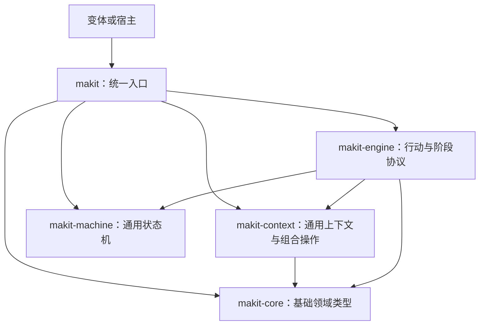

# makit

用于麻将变体开发的 Rust 基础库，提供可共享的领域模型、上下文组合操作、通用状态机和行动编排协议。具体玩法定义规则、输入、事件、阶段及最终结果。

## 统一入口

仓库根的 `makit` 包提供常用类型的显式重导出，并通过四个命名空间保留底层完整 API。

| 入口 | 内容 |
| --- | --- |
| `makit::core` | 牌面、牌面集合与计数、座位、手牌、固定组、牌河、牌墙和种子 |
| `makit::context` | 局上下文、座位扩展、加入及跨牌区组合操作 |
| `makit::machine` | 状态、输入推进、事件、状态转换和初始化包装器 |
| `makit::engine` | 玩法执行协议、主阶段、可复用行动和引擎状态 |

使用者可将根包作为本地依赖，路径按实际位置调整：

```toml
[dependencies]
makit = { path = "../makit" }
```

常用类型可以直接从根部导入；细分错误、操作结果和具体行动保留在所属命名空间：

```rust
use makit::{Context, Engine, EngineInput, IntoMachineState, Seed, Tile};
use makit::context::{ContextError, WallEnd};
use makit::engine::action::setup::{DetermineDealer, Shuffle};
```

根部导出直接使用底层原类型，没有额外的包装类型。使用方也可以按需要单独依赖底层 crate。

## 模块边界



`Tile` 表示牌面，同一牌面的副本等价；`TileMask` 记录成员关系，`TileCounts` 的每种牌面计数独立饱和于 `255`。具体玩法的牌集、通配合法性、吃碰杠权限与胜负计算由变体决定。

`Context<V>` 聚合通用牌区和变体扩展，组合操作维护通用牌区的一致性。`PhaseVariant` 声明玩法输入、事件、最终结果和主阶段；具体 `Phase` 保存执行进度并安排 `Action`。事件面向客户端时的可见范围由使用方处理。

当前引擎提供启动、阶段处理及终态输出契约，已提供洗牌与定庄行动。具体行牌流程、网络交互和恢复协议需要由后续明确的场景补充。

## 开发与检查

项目使用 Rust 2024 edition。根目录的默认 workspace 成员覆盖根包及全部底层 crate，可执行：

```bash
cargo fmt --all -- --check
cargo test --workspace --locked
cargo clippy --workspace --all-targets --locked -- -D warnings
RUSTDOCFLAGS='-D warnings' cargo doc --workspace --no-deps --locked
```

现有独立行动示例可直接运行：

```bash
cargo run -p makit-engine --example shuffle --locked
cargo run -p makit-engine --example determine_dealer --locked
```

目前尚未新增自动化测试用例；`cargo test` 用于执行现有测试目标并检查编译，不能替代具体运行场景的行为核对。
