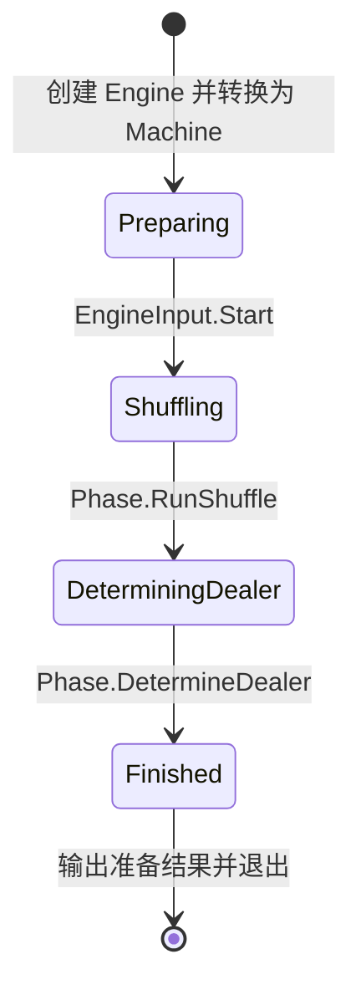
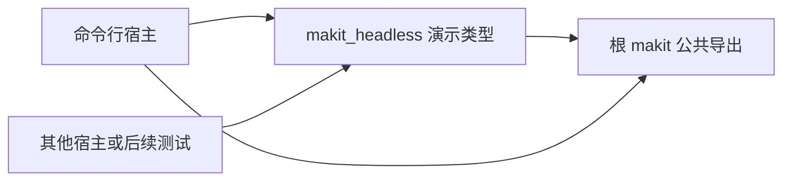

# Headless 准备场景演示

`makit-headless` 使用根 `makit` 导出的 API，将洗牌和定庄组合为一个可以无界面运行的准备场景。它在输出准备结果后退出，没有网络、图形界面或交互式标准输入。

这是引擎组合示例，尚未实现完整麻将玩法、发牌、行牌或结算。示例中的 `Finished` 表示本次准备演示结束，不表示已经完成一手真实麻将。

## 运行

在仓库根目录执行：

```bash
cargo run -p makit-headless --locked
cargo run -p makit-headless --locked -- --align-east
cargo run -p makit-headless --locked -- --seed 0404040404040404040404040404040404040404040404040404040404040404
cargo run -p makit-headless --locked -- --help
```

| 参数 | 含义 |
| --- | --- |
| `--seed HEX` | 完整的 32 字节种子，必须是恰好 64 个 ASCII 十六进制字符，大小写均可；默认 `[4; 32]`，即 `04` 重复 32 次 |
| `--align-east` | 将最终东风位置切换到庄家；默认保留原东风 |
| `--help` | 打印帮助后退出 |

每个选项最多出现一次。`--seed` 与值之间使用空格，不接受前缀 `0x`、空格分隔的字节、Unicode 数字或缩短的种子。参数先完整校验，再决定打印帮助或运行演示。

stdout 以英文显示每次输入的实际处理结果、事件、派发后的阶段，以及最终骰子、庄家、东风和剩余牌编码。stderr 使用英文错误诊断。

| 退出码 | 含义 |
| --- | --- |
| `0` | 演示已得到终态结果，或成功打印帮助 |
| `1` | 预设输入返回未处理或业务错误，或脚本结束时没有终态结果 |
| `2` | 未知参数、重复选项、缺少值或种子无效 |

## 固定配置与流程

演示规则显式保存种子及东风切换配置。初始牌墙按编码为 `[1, 1, 2, 2, 10, 10, 28, 28]`，参与座位为 `1、3、4`，初始东风为位置 `1`。座位在创建 Context 时装配，当前示例没有验证引擎的 Join 交互协议。



`Start` 创建初始 `DemoPhase`，不执行洗牌。后续两次阶段输入分别启动现有 `Shuffle` 与 `DetermineDealer`；行动完成事件由 Phase 封装为 `DemoEvent`，最后通过 `PhaseOutcome::finished` 交付 `DemoOutput`。CLI 只派发输入，阶段决定是否处理以及如何切换。

`DemoPhase::handle` 使用 `PhaseResult<DemoVariant>` 简写返回类型，固定采用变体的阶段、事件、最终结果与业务错误；转换目标为 `DemoPhase`，成功时通过 `PhaseOutcome` 构造继续或结束结果。`PhaseVariant` 的类型声明不附带执行约束；本示例实现 `Phase<DemoVariant> for DemoPhase`，满足引擎初始化和派发的要求。

洗牌后的 `PhaseOutcome::to` 构造 `Continue(Outcome)`，复用基础状态机的事件与转换；定庄后的 `PhaseOutcome::finished` 构造 `Finished { events, output }`。两种成功结果都由引擎记录一次输入及对应事件，再交给机器完成外层转换。

派发返回 `Result<Box<[DemoEvent]>, Error<DemoError>>`。不匹配阶段的输入由 Phase 返回 `Error::Unhandled`；Action 只返回业务错误。定庄前东风位置未加入时，行动直接返回 `DetermineDealerError`，Phase 映射为 `DemoError::DetermineDealer` 并包装到 `Error::Custom`。两类阶段错误均不追加成功记录或切换阶段；CLI 保留失败输入、阶段及业务原因进行诊断。

洗牌使用种子的 ChaCha20 流 `0`，定庄使用流 `1`。定庄从当前东风起逆时针数已加入座位，起点算作 `1`，总步数由两枚骰子决定。相同输入及锁定依赖下可重复运行；更换随机算法或依赖版本后，不承诺牌序仍然相同。

最终牌序是本地准备演示的只读结果副本，便于核对牌集和确定性，不属于面向在线玩家的广播协议或持久化快照。

## 作为库调用

[演示库](src/lib.rs) 导出 `DemoRule`、`DemoVariant`、`DemoPhase`、`DemoInput`、`DemoEvent`、`DemoOutput`、`DemoError` 和 `DemoMachine`。其他宿主可以通过 `Engine::<DemoVariant>::new(DemoRule::new(seed, align_east)).into_machine()` 创建机器，直接使用原生 `dispatch()`、`state()` 和 `state().output()`。



[main.rs](src/main.rs) 只负责宿主脚本与输出，[cli.rs](src/cli.rs) 只负责参数解析。演示库不读取命令行、不打印、不依赖系统时间或外部 I/O；后续测试可逐次输入并直接读取真实结果，不必启动 CLI 子进程。

当前沿用暂不新增 tests / doctests 的约定；示例可运行不代表已经建立自动化行为覆盖。
